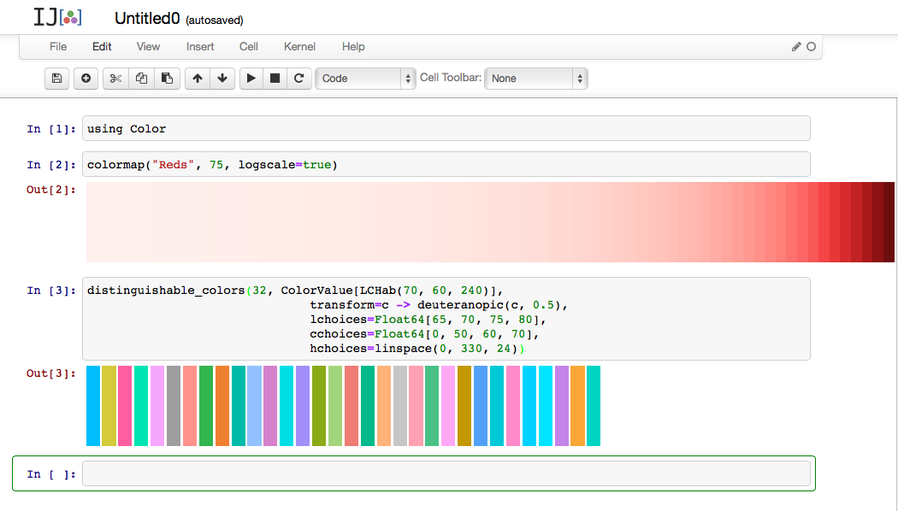
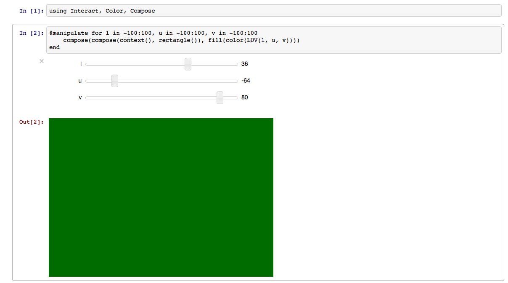

# Color

[](http://pkg.julialang.org/?pkg=Color&ver=release)
[](http://pkg.julialang.org/?pkg=Color&ver=nightly)
[](https://travis-ci.org/JuliaLang/Color.jl)
[](https://coveralls.io/r/JuliaLang/Color.jl)

This package provides a wide array of functions for dealing with color, including functions for converting between color spaces, generating colormaps for graphics, measuring distances between colors, and simulating color vision problems.

### Contents

+ [Basic usage](#basics)
+ [Conversions](#color-conversions)
+ [Color spaces](#color-spaces)
+ [Transparency (alpha values)](#transparency)
+ [CIE Standard Observer](#cie-standard-observer")
+ [Chromatic Adaptation (white balance)](#chromatic-adaptation)
+ [Color Difference](#color-difference)
+ [Simulation of color deficiency ("color blindness")](#color-blindness)
+ [Color Scales](#colorscales)
+ [Colormaps](#colormaps)
+ [References](#references)

## Basic usage <a id="basics"></a>

To install the Color package:

```julia
    Pkg.add("Color")
```

To use the Color package, load the module:

```julia
    using Color
```

You can specify a color:

- by name
- by component values
- as part of a range of colors

### By name

Most of the common names for colors are available directly with the `color()` function:

```julia
    color("red")
    #  RGB{Float64}(1.0,0.0,0.0)

    color("green")
    #  RGB{Float64}(0.0,0.5019607843137255,0.0)

    color("turquoise")
    #  RGB{Float64}(0.25098039215686274,0.8784313725490196,0.8156862745098039)

    color("Red")
    #  RGB{Float64}(1.0,0.0,0.0)

    color("Green")
    #  RGB{Float64}(0.0,0.5019607843137255,0.0)

    color("Gray50")
    #  RGB{Float64}(0.4980392156862745,0.4980392156862745,0.4980392156862745)

    color("Grey50")
    #  RGB{Float64}(0.4980392156862745,0.4980392156862745,0.4980392156862745)
```

(Notice the case-insensitivity, and the alternative spelling for *Gray*. Gray values from 0% to 100% are available as Grey*n* and Gray*n*, with *n* between 0 and 100.)

For example, if you're using [Gadfly](http://dcjones.github.io/Gadfly.jl/), you can specify colors for plot themes using the `color()` function with the `default_color` parameter:

```julia
    ... Theme(default_color=color("orange")) ...
```

The full list of recognized color names (together with their RGB equivalents as a tuple of integers between 0 and 255) is available in the dictionary `Color.color_names`.

An SVG color chart showing the colors and names is available in [images/color_names_sorted.svg](images/color_names_sorted.svg).

All the CSS/SVG named colors are supported, in addition to X11 named colors, where their definitions do not clash with SVG.

In all cases, a `RGB` color is returned, except when the `HSL()` syntax is used, when a `HSL` value is returned.

### By values

You can supply a string of 3 or 6 hexadecimal digits, as used in CSS, to specify the color:

```julia
    color("#ff00cc")
    #  RGB{Float64}(1.0,0.0,0.8)

    color("#f0c")
    #  RGB{Float64}(0.9411764705882353,0.0,0.7529411764705882)
```

The `color()` function parses all [CSS color specifications](https://developer.mozilla.org/en-US/docs/CSS/color), with the exception of `currentColor`. (See [Transparency](#transparency) for specifying alpha values.)

If you specify the color space (see [Color spaces](#color-spaces)), you can supply the values relevant to that space:

```julia
    color(LUV(55, 175, 40))
    #  Luv{Float64}(55.0,175.0,40.0)

    color(HSV(55, 1, 0.5))  # hue between 0 and 360 degrees
    #  HSV{Float64}(55.0,1.0,0.5)

    color(RGB(1, 0.5, 0))
    #  RGB{Float64}(1.0,0.5,0.0)
```

### As part of a range of colors

A *colormap* (also called palette, gradient, or ramp) is an array of *n* color values. These can be organized to produce:

+ a *sequential* colormap - the *i*th color is a visible indicator of the location of *i* in the range 1:*n*
+ a *diverging* colormap - colors indicate a significant median value, and values above the median have different colors to those below
+ a *colorscale* - each color is easy to distinguish

It's possible to define colormaps by creating an array of color values directly, using for example `linspace()`:

```julia
    red2blue = linspace(color("red"), color("blue"), 100)
    #  100-element Array{RGB{Float64},1}:
         RGB{Float64}(1.0,0.0,0.0)
         RGB{Float64}(0.98989898989899,0.0,0.010101010101010055)
         ...
         RGB{Float64}(0.010101010101010102,0.0,0.98989898989899)
         RGB{Float64}(0.0,0.0,1.0)

    rainbow = linspace(Color.HSV(0,1,1),Color.HSV(330,1,1),64)
    #    64-element Array{HSV{Float64},1}:
         HSV{Float64}(0.0,1.0,1.0)
         HSV{Float64}(5.238095238095256,1.0,1.0)
         ...
         HSV{Float64}(324.76190476190476,1.0,1.0)
         HSV{Float64}(330.0,1.0,1.0)
```

and then access them as array elements:

```julia
    red2blue[42]
    # RGB{Float64}(0.5858585858585859,0.0,0.41414141414141414)

    rainbow[1]
    # HSV{Float64}(0.0,1.0,1.0)
```

However, the Color.jl package can also create color schemes designed to work better with human vision characteristics. These can be more appealing to the eye and more effective at communicating information, and should be used for presentation graphics in preference to the simpler schemes based on RGB values and computer screen technology.

For example, the following defines a 32-color palette using the [LCHab](#LCHab) color space, so that the colors are all easy to distinguish:

```julia
    distinguishable_colors(32, ColorValue[LCHab(70, 60, 240)],
                               transform=c -> deuteranopic(c, 0.5),
                               lchoices=Float64[65, 70, 75, 80],
                               cchoices=Float64[0, 50, 60, 70],
                               hchoices=linspace(0, 330, 24))
```

Colormaps restricted to a specific color can be generated using `colormap()`:

```julia
    colormap("Reds", 50) # or "Blues", "Greens", "Grays", "Oranges", "Purples"
    #  50-element Array{RGB{Float64},1}:
        RGB{Float64}(1.0,0.9468213503677428,0.9365728175557527)
        ...
    colormap("Reds", 50, logscale=true) # 50 shades of red, logarithmically spaced
    #  50-element Array{RGB{Float64},1}:
        RGB{Float64}(1.0,0.941139714053743,0.9299207179476242)
        ...
```

The [ColorBrewer](https://github.com/timothyrenner/ColorBrewer.jl) package provides a number of built-in sequential and diverging colormaps, and a `palette()` function that lets you define your own.

For more details, see the descriptions below:

+ [Color Scales](#colorscales)
+ [Colormaps](#colormaps)

### Interactive exploration

A good environment for exploring the Color package interactively is a Jupyter (IPython) notebook. The results of many of the functions are drawn directly as color swatches:



You can build interactive color widgets using the Interact.jl and Compose.jl packages:



## Color conversions <a id="color-conversions"></a>

Colors can be converted from one color space to another with the `convert()` function. For example, to convert a HSV (Hue/Saturation/Value) color to RGB:

```julia
    convert(RGB, HSV(55, 1, 0.5))
    #  RGB{Float64}(0.5,0.4583333333333333,0.0)
```

However, depending on the source and destination color space, this may not be a lossless conversion.

## Color spaces <a id="color-spaces"></a>

The Color.jl package supports the following color spaces:

+ [RGB](#RGB)
+ [HSV](#HSV)
+ [HSL](#HSL)
+ [XYZ](#XYZ)
+ [xyY](#xyY)
+ [LAB](#LAB)
+ [LUV](#LUV)
+ [LCHab](#LCHab)
+ [LCHuv](#LCHuv)
+ [DIN99](#DIN99)
+ [DIN99d](#DIN99d)
+ [DIN99o](#DIN99o)
+ [LMS](#LMS)
+ [RGB24](#RGB24)

— see also [Transparency](#transparency).

### RGB <a id="RGB"></a>

This uses the sRGB color space, the most common RGB color space.

```julia
immutable RGB{T} <: ColorValue
    r::T # Red in [0,1]
    g::T # Green in [0,1]
    b::T # Blue in [0,1]
end
```

RGB colors may be defined with two main number types: `FloatingPoint` and `FixedPoint`.

`FixedPoint` comes from the [`FixedPointNumbers`](https://github.com/JeffBezanson/FixedPointNumbers.jl) package, and represents fractional numbers (between 0 and 1, inclusive) internally using integers.

For example, `0xffuf8` creates a `Ufixed8` number with value equal to `1.0` but which internally is represented as `0xff`. This strategy ensures that `1` always means "saturated color", regardless of how that value is represented. Ordinary integers should not be used, although the convenience constructor `RGB(1,0,0)` will create a value `RGB{Float64}(1.0, 0.0, 0.0)`.

The parametric representation of colors facilitates interfacing with external libraries that may require a specific representation. It's also worth nothing that this package defines an `AbstractRGB{T}` type, from which you can define your own variants of RGB. For example, if you need a `BGR{Ufixed8}<:AbstractRGB{Ufixed8}` type to interface with a C library, you can define this easily. See an example of this in the [`test/layout.jl` file](test/layout.jl).

If you do define your own `AbstractRGB`, note that the constructor **must initialize the values in the order `(r,g,b)` regardless of how they are arranged internally in memory**.

### HSV <a id="HSV"></a>

Hue-Saturation-Value. A common projection of RGB to cylindrical coordinates. This is also sometimes called "HSB", for Hue-Saturation-Brightness.

```julia
immutable HSV{T} <: ColorValue
    h::T # Hue in [0,360]
    s::T # Saturation in [0,1]
    v::T # Value in [0,1]
end
```

`T` must be of `FloatingPoint` type, since the values range beyond what can be represented with most `FixedPoint` types.

### HSL <a id="HSL"></a>

Hue-Saturation-Lightness. Another common projection of RGB to cylindrical coordinates.

```julia
immutable HSL{T} <: ColorValue
    h::T # Hue in [0,360]
    s::T # Saturation in [0,1]
    l::T # Lightness in [0,1]
end
```

### XYZ <a id="XYZ"></a>

The XYZ color space as standardized by the CIE in 1931, based on experimental measurements of color perception culminating in the [CIE Standard Observer](#cie-standard-observer") (see `cie_color_match()`)

```julia
immutable XYZ{T} <: ColorValue
    x::T
    y::T
    z::T
end
```

Currently, XYZ is the only type other than RGB supporting `FixedPoint`.

### xyY <a id="xyY"></a>

The xyY color space is another CIE standardized color space, based directly on a transformation from XYZ. It was developed specifically because the xy chromaticity space is invariant to the lightness of the patch.

```julia
immutable xyY{T} <: ColorValue
    x::T
    y::T
    Y::T
end
```

### LAB <a id="LAB"></a>

A perceptually-uniform color space standardized by the CIE in 1976. See also LUV, the associated color space standardized the same year.

```julia
immutable LAB{T} <: ColorValue
    l::T # Luminance in approximately [0,100]
    a::T # Red/Green
    b::T # Blue/Yellow
end
```

### LUV <a id="LUV"></a>

A perceptually uniform color space standardized by the CIE in 1976. See also LAB, a similar color space standardized the same year.

```julia
immutable LUV{T} <: ColorValue
    l::T # Luminance
    u::T # Red/Green
    v::T # Blue/Yellow
end
```

### LCHab <a id="LCHab"></a>

The LAB color space re-parameterized using cylindrical coordinates.

```julia
immutable LCHab{T} <: ColorValue
    l::T # Luminance in [0,100]
    c::T # Chroma
    h::T # Hue in [0,360]
end
```

### LCHuv <a id="LCHuv"></a>

The LUV color space re-parameterized using cylindrical coordinates.

```julia
immutable LCHuv{T} <: ColorValue
    l::T # Luminance
    c::T # Chroma
    h::T # Hue
```

### DIN99 <a id="DIN99"></a>

The DIN99 uniform color space as described in the DIN 6176 specification.

```julia
immutable DIN99{T} <: ColorValue
    l::T # L99 (Lightness)
    a::T # a99 (Red/Green)
    b::T # b99 (Blue/Yellow)
```

### DIN99d <a id="DIN99d"></a>

The DIN99d uniform color space is an improvement on the DIN99 color space that adds a correction to the X tristimulus value in order to emulate the rotation term present in the DeltaE2000 equation.

```julia
immutable DIN99d{T} <: ColorValue
    l::T # L99d (Lightness)
    a::T # a99d (Redish/Greenish)
    b::T # b99d (Blueish/Yellowish)
```

### DIN99o <a id="DIN99o"></a>

Revised version of the DIN99 uniform color space with modified coefficients for an improved metric. Similar to DIN99d X correction and the DeltaE2000 rotation term, DIN99o achieves comparable results by optimized `a*/b*rotation` and chroma compression terms.

```julia
immutable DIN99o{T} <: ColorValue
    l::T # L99o (Lightness)
    a::T # a99o (Red/Green)
    b::T # b99o (Blue/Yellow)
```

### LMS <a id="LMS"></a>

Long-Medium-Short cone response values. Multiple methods of converting to LMS space have been defined. Here the [CAT02](https://en.wikipedia.org/wiki/CIECAM02#CAT02) chromatic adaptation matrix is used.

```julia
immutable LMS{T} <: ColorValue
    l::T # Long
    m::T # Medium
    s::T # Short
end
```

### RGB24 <a id="RGB24"></a>

An RGB color represented as 8-bit values packed into a 32-bit integer.

```julia
immutable RGB24 <: ColorValue
    color::Uint32
end
```

## Transparency (alpha values)  <a id="transparency"></a>

This package lets you define types that store a transparency value with the `AlphaColorValue` type. For example:

```julia
faintred = AlphaColorValue(RGB(1,0,0),0.25)
```

A value of 1.0 is fully opaque, 0.0 is completely transparent.

Transparent versions of colors are available with an "A" suffix. For example:

+ RGBA{T} is an alias for AlphaColorValue{RGB{T},T}
+ HSVA{T} is an alias for AlphaColorValue{HSV{T},T}
+ LuvA{T} is an alias for AlphaColorValue{Luv{T},T}

and so on. Similarly, conversions are available:

+ rgba{T}(c::ColorValue{T}) = AlphaColorValue(convert(RGB{T},c))
+ hsva{T}(c::ColorValue{T}) = AlphaColorValue(convert(HSV{T},c))
+ luva{T}(c::ColorValue{T}) = AlphaColorValue(convert(Luv{T},c))

and so on.

You can define transparent colors by using these conversion functions to convert an ordinary color to a transparent version:

```julia
    rgba(color("red"))
    # AlphaColorValue{RGB{Float64},Float64}(RGB{Float64}(1.0,0.0,0.0),1.0)

    rgba(color(RGB(1,0,0)))
    # AlphaColorValue{RGB{Float64},Float64}(RGB{Float64}(1.0,0.0,0.0),1.0)
```

Notice that you can't directly use functions like `rgba()` or constructors like `RGBA()` with four values to create a color with transparency, unless you specify the type as well:

```julia
    RGBA(1, 1, 1, 0.5)
    # ERROR: type: apply: expected Function, got Type{AlphaColorValue{RGB{T},T}}

    RGBA{Float64}(1, 1, 1, 0.5)
    AlphaColorValue{RGB{Float64},Float64}(RGB{Float64}(1.0,1.0,1.0),0.5)
```

## CIE Standard Observer  <a id="cie-standard-observer"></a>

`cie_color_match(wavelen::Real)`

The CIE defines a standard observer, defining a typical frequency response curve for each of the three human cones. The `cie_color_match()` function returns an XYZ color corresponding to a wavelength specified in nanometers.

## Chromatic Adaptation (white balance)  <a id="chromatic-adaptation"></a>

`whitebalance{T <: ColorValue}(c::T, src_white::ColorValue, ref_white::ColorValue)`

converts a color `c` viewed under conditions with a given source whitepoint `src_whitepoint`, to appear the same under a different conditions specified by a reference whitepoint `ref_white`.

## Color Difference  <a id="color-difference"></a>

The `colordiff()` function calculates the difference between colors:

`colordiff(a::ColorValue, b::ColorValue)`

It uses the [CIEDE2000](http://en.wikipedia.org/wiki/Color_difference#CIEDE2000) color difference formula. This gives an approximate measure of the perceptual difference between two colors to a typical viewer. A large number is returned for increasingly distinguishable colors.

`colordiff(a::ColorValue, b::ColorValue, m::DifferenceMetric)`

evaluates the color difference formula specified by the supplied `DifferenceMetric`.

Options are as follows:

`DE_2000(kl::Float64, kc::Float64, kh::Float64)`

`DE_2000()`

specifies the color difference using the recommended CIEDE2000 equation, with weighting parameters `kl`, `kc`, and `kh` as provided for in the recommendation. When not provided, these parameters default to 1.

`DE_94(kl::Float64, kc::Float64, kh::Float64)`

`DE_94()`

specifies the color difference using the recommended CIEDE94 equation, with weighting parameters `kl`, `kc`, and `kh` as provided for in the recommendation. When not provided, these parameters default to 1.

`DE_JPC79()`

specifies McDonald's "JP Coates Thread Company" color difference formula.

`DE_CMC(kl::Float64, kc::Float64)`

`DE_CMC()`

specifies the color difference using the CMC equation, with weighting parameters `kl` and `kc`. When not provided, these parameters default to 1.

`DE_BFD(wp::XYZ, kl::Float64, kc::Float64)`

`DE_BFD(kl::Float64, kc::Float64)`

`DE_BFD()`

specifies the color difference using the BFD equation, with weighting parameters `kl` and `kc`. Additionally, a white point can be specified, because the BFD equation must convert between `XYZ` and `LAB` during the computation. When not specified, the constants default to 1, and the white point defaults to CIE D65.

`DE_AB()`

specifies the original, Euclidian color difference equation.

`DE_DIN99()`

specifies the Euclidian color difference equation applied in the `DIN99` uniform color space.

`DE_DIN99d()`

specifies the Euclidian color difference equation applied in the `DIN99` uniform color space.

`DE_DIN99o()`

specifies the Euclidian color difference equation applied in the `DIN99` uniform color space.

## Simulation of color deficiency ("color blindness")  <a id="color-blindness"></a>

Three functions are provided that map colors to a reduced gamut, to simulate different types of *dichromacy*, the loss of one of the three types of human photopigments.

```julia
protanopic(c::ColorValue)

deuteranopic(c::ColorValue)

tritanopic(c::ColorValue)
```

*Protanopia*, *deuteranopia*, and *tritanopia* are the loss of long, middle, and short wavelength photopigment, respectively. These functions take a color and return a modified color in the same color space.

Also provided are versions of these functions with an extra parameter `p` in `[0,1]`, giving the degree of photopigment loss, where 1.0 is a complete loss, and 0.0 is no loss at all:

```julia
protanopic(c::ColorValue, p::Float64)

deuteranopic(c::ColorValue, p::Float64)

tritanopic(c::ColorValue, p::Float64)
```

## Color Scales  <a id="colorscales"></a>

`distinguishable_colors(n::Integer)`

generates `n` maximally distinguishable colors in the [LCHab](#LCHab) color space.

A seed color or array of seed colors may be provided to `distinguishable_colors()`, and the remaining colors will be chosen to be maximally distinguishable from the seed colors and each other.

```julia
distinguishable_colors(n::Integer,seed::ColorValue)

distinguishable_colors{T<:ColorValue}(n::Integer,seed::AbstractVector{T})

distinguishable_colors{T<:ColorValue}(n::Integer, seed::AbstractVector{T};
    transform::Function = identity,
    lchoices::AbstractVector = linspace(0, 100, 15),
    cchoices::AbstractVector = linspace(0, 100, 15),
    hchoices::AbstractVector = linspace(0, 340, 20)
)
```

By default, `distinguishable_colors()` chooses maximally distinguishable colors from the outer product of lightness, chroma, and hue values specified by `lchoices = linspace(0, 100, 15)`, `cchoices = linspace(0, 100, 15)`, and `hchoices = linspace(0, 340, 20)`. The set of colors that `distinguishable_colors()` chooses from can be specified if you pass different choices as keyword arguments.

Distinguishability is maximized with respect to the CIEDE2000 color difference formula (see [Color Difference](#color-difference)). If a `transform` function is specified, color difference is instead maximized between colors `a` and `b` according to `colordiff(transform(a), transform(b))`.

`linspace(c1::ColorValue, c2::ColorValue, n=100)`

generates `n` colors in a linearly interpolated ramp from `c1` to `c2`, inclusive, returning an `Array` of colors.

`weighted_color_mean(w1::Real, c1::ColorValue, c2::ColorValue)`

returns a color that is the weighted mean of `c1` and `c2`, where `c1` has a weight 0 ≤ `w1` ≤ 1.

`MSC(h)`

returns the most saturated color for a given hue `h` (defined in LCHuv space, i.e. in range [0, 360]). Optionally the lightness `l` can also be given, as `MSC(h, l)`. The color is found by finding the edge of the LCHuv space for a given angle (hue).

## Colormaps  <a id="colormaps"></a>

Colormaps can be created with the `colormap()` function:

`colormap(cname::String [, N::Int=100; mid=0.5, logscale=false, kvs...])`

which returns a predefined sequential or diverging colormap computed using the algorithm by Wijffelaars, M., et al. (2008). (See [References](#references).)

Optional arguments are:

* `N`        - number of colors
* `mid`      - the relative location of the middle point where the color changes from e.g. red to blue
* `logscale` - true/false to use logarithmic scaling

The colormaps computed by this algorithm have an increasing perceived depth or saturation, making them ideal for data visualization. This also means that they are (in most cases) "colorblind-friendly" and suitable for black-and-white printing.

### Pre-defined colormaps

The currently supported colormap names are:

#### Sequential

| Name       | Example |
| ---------- | ------- |
| Blues |  |
| Greens |  |
| Grays | <!-- image to go here --> |
| Oranges |  |
| Purples |  |
| Reds |  |

#### Diverging

| Name       | Example |
| ---------- | ------- |
| RdBu (from red to blue) |  |

### Creating new colormaps

You can create your own colormaps using the `sequential_palette()` and `diverging_palette()` functions:

`sequential_palette(h, [N::Int=100;
    c=0.88, s=0.6, b=0.75,
    w=0.15, d=0.0,
    wcolor=RGB(1,1,0), dcolor=RGB(0,0,1),
    logscale=false])`

creates a sequential map for the hue `h` (defined in LCHuv space). To fine-tune the results, adjust the following parameters:

* `N`        - number of colors
* `c`        - the overall lightness contrast [0,1]
* `s`        - saturation [0,1]
* `b`        - brightness [0,1]
* `w`        - cold/warm parameter, i.e. the strength of the starting color [0,1]
* `d`        - depth of the ending color [0,1]
* `wcolor`   - starting color (usually defined to be yellow)
* `dcolor`   - ending color (depth)
* `logscale` - true/false to use logarithmic scaling

Two sequential maps can also be combined into a *diverging colormap* with the `diverging_palette()` function:

`diverging_palette(h1, h2 [, N::Int=100;
    mid=0.5, c=0.88, s=0.6, b=0.75, w=0.15,
    d1=0.0, d2=0.0, wcolor=RGB(1,1,0),
    dcolor1=RGB(1,0,0), dcolor2=RGB(0,0,1),
    logscale=false])`

where the required arguments are:

* `h1`       - the main hue of the left side [0,360]
* `h2`       - the main hue of the right side [0,360]

and the optional arguments are:

* `N`        - number of colors
* `mid`      - the relative location of the middle point where the color changes
* `c`        - the overall lightness contrast [0,1]
* `s`        - saturation [0,1]
* `b`        - brightness [0,1]
* `w`        - cold/warm parameter, i.e. the strength of the middle color [0,1]
* `d1`       - depth of the ending color on the left side [0,1]
* `d2`       - depth of the ending color on the right side [0,1]
* `wcolor`   - starting color i.e. the middle color (warmness, usually defined to be yellow)
* `dcolor1`  - ending color of the left side (depth)
* `dcolor2`  - ending color of the right side (depth)
* `logscale` - true/false to use logarithmic scaling

# References <a id="references"></a>

What perceptually uniform color spaces are and why you should be using them:

* Ihaka, R. (2003).
  [Colour for Presentation Graphics](http://www.stat.auckland.ac.nz/~ihaka/downloads/DSC-Color.pdf).
  In K Hornik, F Leisch, A Zeileis (eds.),
  Proceedings of the 3rd International Workshop on Distributed Statistical Computing,
  Vienna, Austria. ISSN 1609-395X
* Zeileis, A., Hornik, K., and Murrell, P. (2009).
  [Escaping RGBland: Selecting colors for statistical graphics](http://epub.wu.ac.at/1692/1/document.pdf).
  Computational Statistics and Data Analysis,
  53(9), 3259–3270. doi:10.1016/j.csda.2008.11.033

Functions in this library were mostly implemented according to:

* Schanda, J., ed.
  [Colorimetry: Understanding the CIE system](http://books.google.pt/books?id=uZadszSGe9MC).
  Wiley-Interscience, 2007.
* Sharma, G., Wu, W., and Dalal, E. N. (2005).
  [The CIEDE2000 color‐difference formula](http://www.ece.rochester.edu/~gsharma/ciede2000/ciede2000noteCRNA.pdf):
  Implementation notes, supplementary test data, and mathematical observations.
  Color Research & Application, 30(1), 21–30. doi:10.1002/col
* Ihaka, R., Murrel, P., Hornik, K., Fisher, J. C., and Zeileis, A. (2013).
  [colorspace: Color Space Manipulation](http://CRAN.R-project.org/package=colorspace).
  R package version 1.2-1.
* Lindbloom, B. (2013).
  [Useful Color Equations](http://www.brucelindbloom.com/index.html?ColorCalculator.html)
* Wijffelaars, M., Vliegen, R., van Wijk, J., van der Linden, E-J. (2008). [Generating Color Palettes using Intuitive Parameters](http://magnaview.nl/documents/MagnaView-M_Wijffelaars-Generating_color_palettes_using_intuitive_parameters.pdf)
* Georg A. Klein
  [Industrial Color Physics](http://http://books.google.de/books?id=WsKOAVCrLnwC).
  Springer Series in Optical Sciences, 2010. ISSN 0342-4111, ISBN 978-1-4419-1197-1.
